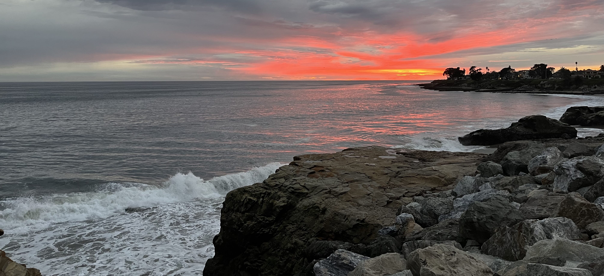

# Brian Gerkey

I'm CTO at [Intrinsic](https://intrinsic.ai/). We're democratizing access to robotics.

I'm co-founder, former CEO and current board chair of [Open Robotics](http://www.openrobotics.org), where we build open source software and hardware for the global robotics community.

I'm passionate about interoperable, open, reusable robot software.

Before that, I worked at [Willow Garage](http://www.willowgarage.com), the [SRI Artificial Intelligence Center](http://ai.sri.com), the [Stanford Artificial Intelligence Lab](http://ai.stanford.edu), and the [USC Interaction Lab](http://robotics.usc.edu/interaction/).

I'm not looking for a job, but here's my CV: \[[PDF](media/cv.pdf)\]

I frequently speak at conferences and with media outlets about topics including robotics, autonomy, and open source. Select public speaking and media appearances:

- [Universal Robotics ReAutomated Podcast](https://www.youtube.com/watch?v=AR2SUkfopCI) (2025)
- [ROSCon](https://vimeo.com/1024971401) (2024 & [prior years](https://roscon.ros.org/2024/#archive))
- [Red Hat Open Source Stories](https://redhat.com/robots) (2020)
- [TFiR Newsroom](https://www.youtube.com/watch?v=5OyNUxIkeKQ) (2020)
- [Red Hat Summit](https://youtu.be/qj0IUKK9EMs) (2020)
- [ROSCon FR](https://vimeo.com/343427625) (2019)
- [Faces of Open Source](http://www.facesofopensource.com/ros/) (2018)
- [ROSCon JP](https://vimeo.com/292064161) (2018)
- [All Things Open](https://www.youtube.com/watch?v=LwhRkZ3lk2U) (2017)
- [TechCrunch Sessions](https://www.youtube.com/watch?v=QOuPG8gW_AY) (2017)
- [Bloomberg Technology](https://www.bloomberg.com/news/videos/2017-05-17/the-silicon-valley-startup-creating-robot-dna-video) (2017)
- [Techonomy](https://techonomy.com/conf/te15/videos-shorts-talks-180s/brian-gerkey/) (2015)
- [EmTech](https://www.youtube.com/watch?v=Mp6OyzNIVwA) (2011)
- [IEEE Oral History](http://ieeetv.ieee.org/history/robotics-history-narratives-and-networks-oral-histories-brian-gerkey) (2011)

If you are organizing a meeting or producing a story where I might be able to contribute, feel free to contact me.

## Bio and Headshot

*Brian Gerkey is CTO at Intrinsic, where he's helping to democratize access to robotics. Brian was previously co-founder and CEO at Open Robotics, and is a board member of the Open Source Robotics Foundation. He has also worked at Willow Garage, SRI, Stanford, and USC. Brian is a strong believer in, frequent contributor to, and constant beneficiary of open source technology.*

Headshot: \[[large](media/briangerkey.jpg)\] \[[small](media/brian-small.png)\]

## Contact

640 Clyde Ct, Mountain View, CA 94043, USA

gerkey \[at\] intrinsic \[dot\] ai

[Press or media inquiries](https://www.intrinsic.ai/press)
